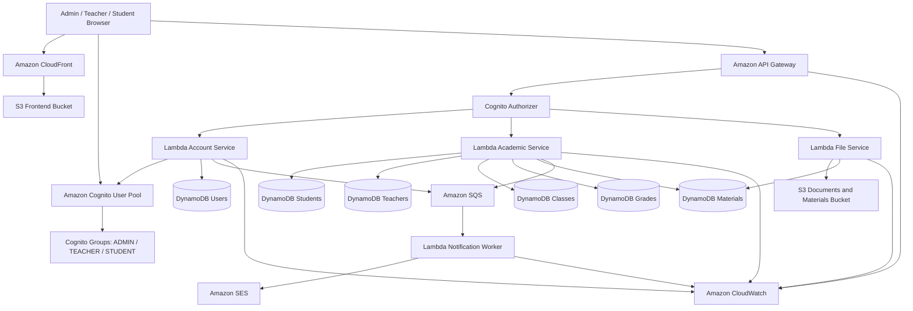

### Project Overview
**AWS Student Management Portal** is a web application built completely on a **Serverless architecture on AWS**. The system enables academic information, profile, and document management for students via an intuitive web interface.

The system serves three user groups:
- **Admin**: Manages user accounts, Cognito user pool group memberships, and monitors logs.
- **Teacher**: Manages assigned classes, inputs/edits grades, and uploads learning materials.
- **Student**: Views personal profiles, queries grades, and views/downloads course materials.

---
### Architecture Overview
The application is designed using a serverless model to eliminate server management (no EC2), auto-scale with traffic, and optimize costs.

---
### Core Components
| Component | AWS Service | Role |
| :--- | :--- | :--- |
| **Static Web** | Amazon S3 + CloudFront | Hosting & CDN distribution for React static assets |
| **Authentication** | Amazon Cognito | Sign-in, sign-up, JWT token issuance, and group-based authorization |
| **API Gateway** | Amazon API Gateway | Handles REST API requests, secured via Cognito Authorizer |
| **Backend** | AWS Lambda | Executes business logic (Node.js) for student, teacher, grade, and material modules |
| **Database** | Amazon DynamoDB | NoSQL database for students, teachers, classes, grades, and material metadata |
| **File Storage** | Amazon S3 | Document and material storage via secure **Presigned URL** mechanism |
| **Message Queue** | Amazon SQS | Asynchronous message transfer for notifications to prevent bottlenecks |
| **Email Service** | Amazon SES | Automated email delivery (new sign-ins, academic updates) |
| **Monitoring** | Amazon CloudWatch | Log management, error tracking, and performance metrics |

---
### Main Process Flows
#### 1. Authentication & Authorization
- Users log in from Frontend → get JWT Token from **Cognito User Pool**.
- Frontend decodes user roles (`ADMIN`, `TEACHER`, `STUDENT`) to route dashboard layout.
- All API requests carry the Token in the `Authorization` header. **API Gateway** uses Cognito Authorizer to validate tokens before forwarding requests to **Lambda**.

#### 2. Learning Material Upload Flow
- Teacher uploads file → Frontend requests URL → Lambda creates a short-lived **S3 Presigned URL**.
- Frontend uploads file directly to **S3 Bucket** using the Presigned URL (bypassing Lambda upload bandwidth limit).
- After upload, Frontend saves metadata to **DynamoDB** and pushes a notification message into **SQS**.
- **Lambda Notification Worker** consumes the SQS message and triggers **SES** to email students.
